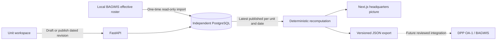

# Architecture and data contract

## Runtime

Next.js serves a production-built interface on loopback port 3200. Same-origin `/api/*` requests proxy to FastAPI on 8200, avoiding client-side cross-origin credentials. In Docker the proxy destination is baked as `http://api:8200`; host development defaults to localhost. PostgreSQL 16 is independent on loopback port 5546. Compose waits for database and API health before starting downstream services.

No background process fetches from or writes to BAGWIS. No reporting data is sent off the laptop. There are no remote font, analytics or image dependencies; Next.js telemetry is disabled in the container build.

## Core records

| Record | Ownership and semantics |
| --- | --- |
| `units` | Stable prototype ID, display name, parent, reporting flag and source/mapping metadata. The initial tree is candidate ownership from source mother/sub-unit labels. |
| `personnel` | Initial roster identity, unit owner, BAGWIS display name, effective source rank/category, minimal source provenance and a `starts_on` date for local additions. |
| `returns` | Immutable full snapshot for a unit and reporting day. Includes monotonic unit/day revision, draft/published state, actor, reason, timestamp, entries, organization snapshot, establishment and submission policy ID. |
| `policies` | Immutable version of status labels and their availability effects, with actor and reason. |
| `seed_runs` | Import manifest: source table/filter, snapshot hash, source refresh range, import time, population, mapping scope and demonstration caveats. |

PostgreSQL triggers reject updates and deletes on returns and policies. A unique constraint on `(unit_id, day, revision)` plus a unit-row lock serializes saves. The API requires `expected_revision`, returning HTTP 409 if another save has advanced it.

The schema is initialized idempotently from `backend/schema.sql`. It is intentionally small for the local prototype; formal migration tooling and retention roles are future production work.

## Reporting semantics

- A published return is a complete owning-unit roster snapshot, not a delta. Missing IDs, duplicated IDs and foreign-unit IDs are rejected.
- A person has exactly one primary daily status: available, passes, hospitalized, MWB, leave, detached, unconfirmed, or a documented not-assigned correction. This exclusivity is a prototype assumption requiring operational validation.
- Rank/category corrections belong to the dated return. They do not modify the BAGWIS baseline. A new day intentionally starts from the baseline as unconfirmed; the UI displays the prior publication date. Persistent transfers and cross-unit identity reconciliation need a future controlled workflow.
- Adding a missing person creates a local UUID and provenance. They appear from the specified date, unconfirmed. Older published snapshots are not modified. The next publication must include them.
- Headquarters aggregates only reporting owners in its descendant scope. Command nodes never add a second copy of descendant totals. The seeded parent tree is static; organizational changes require a versioned migration before historical reparenting is supported.
- The selected date uses the latest **published** revision for each owner. Later drafts do not replace it. No previous-day return is silently carried forward.
- Missing reports are excluded from reported counts and appear in coverage. Baseline roster count is an expectation aid, not a substitute for a unit return.
- Counts are computed directly from snapshots. Availability percentages are derived from summed counts, never averaged unit percentages. Unresolved statuses suppress the definitive rate. Partial coverage remains prominently labeled even if all reported statuses are resolved.
- Establishments are optional, unit-declared counts for Officer, EP, Civilian and Unclassified. All four counts and a named authority/version are required together. Negative values are rejected. A missing or zero total produces no fill rate; values above 100% are permitted. The prototype does not assign official R1–R4 ratings.
- All dashboards use the current policy, including historical dates. Each revision retains its submission policy; `/history/{id}` returns original-policy metrics for comparison. The UI explicitly describes this distinction.

## API

See live `/docs` for request schemas and interactive inspection.

| Endpoint | Purpose |
| --- | --- |
| `GET /health` | Database-backed service health |
| `GET /workspaces` | Available demo identities and scopes |
| `POST /session` | Explicit local demo workspace selection; signed HttpOnly SameSite cookie |
| `GET /session` | Current demo identity |
| `GET /dashboard?root=&day=` | Coverage, unit state, current-policy aggregate metrics, source revision references |
| `GET /trend?root=&day=` | Seven daily recomputations with coverage |
| `GET /units/{id}/return?day=` | Latest draft/publication, roster, prior date and revision list |
| `POST /units/{id}/return` | Owner-only save or publish with optimistic concurrency |
| `POST /units/{id}/personnel` | Owner-only local roster addition with source reason and effective date |
| `GET /history/{id}` | Scoped immutable snapshot and submission-policy metrics |
| `POST /policy` | DPP pilot-root policy version update with expected version |
| `GET /policy/history` | Policy definitions and decisions |
| `GET /provenance` | Minimal seed manifest |
| `GET /reference` | Workbook discovery document pointer |
| `GET /export?root=&day=` | Candidate aggregate integration contract |

## Candidate upward export

`schema_version: unit-readiness.v1` exports reporting day, scope, computed timestamp, current policy, aggregate category/rank/status counts, per-owner state/establishment, coverage and exact source return IDs/revisions with submission policy IDs. It excludes personnel names and roster-level source identifiers. Each published correction advances its revision, making downstream replacement explicit.

The export is computed on demand. A downloaded JSON is an immutable local artifact; the endpoint itself reflects later corrections and policy changes. There is no delivery queue, receiver acknowledgment, digital signature, approval workflow or BAGWIS ingestion adapter yet. A downstream service must enforce source ownership, identity reconciliation, policy compatibility and period/coverage checks before using these records as official data.

## Local security boundary

The demo selector intentionally permits choosing any seeded workspace. It is not login/authentication for operational deployment. After selection, backend checks enforce owning-unit writes and descendant read scope, even if requests bypass the UI. The DPP pilot root alone can change shared policy. Sessions expire after one day.

All published host ports bind to `127.0.0.1`; PostgreSQL credentials and session signing are independent of BAGWIS. `.env`, `.local`, workbooks, snapshots and backups are ignored by Git. Source data lives only in the dedicated database and controlled local artifacts. Do not treat loopback binding or BAGWIS display as permission for public deployment. Production needs real identity, policy-defined roles, medical-data access controls, audit operations and validated reporting boundaries.

The seed configuration resides in `scripts/seed.py`: explicit grouping lists and review fallback are kept out of the calculation engine. The calculation defaults live in `DEFAULT_RULES`, with versioned MWB/passes decisions exposed in the policy UI. An unresolved policy is represented by `null`, not an assumed available person.
